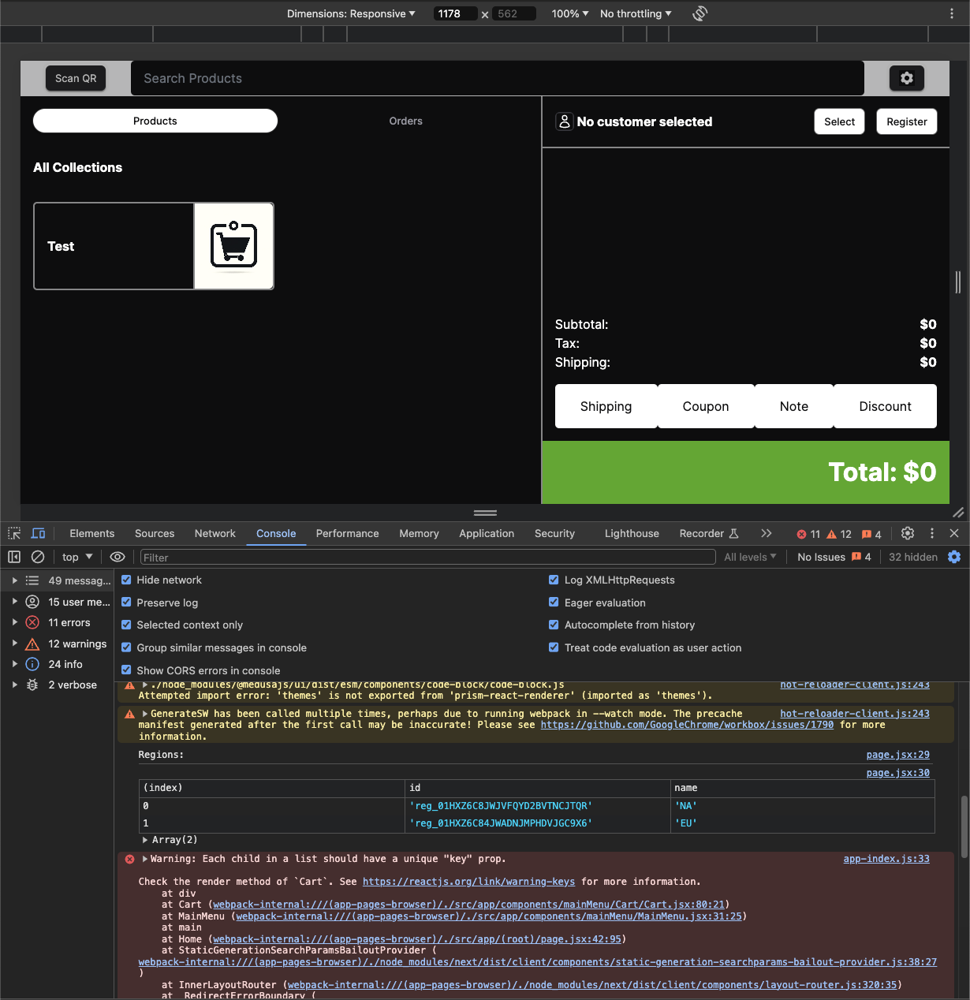

# ⚠️ Legacy POS Application (NextJS)

This is a legacy version built with NextJS for testing API flows between the POS application, Medusa Server API, and Stripe POS.

**Note:** This version is not intended for production use and serves as an exploration blueprint for the production version that we are building in the `develop` branch. Expect bugs, spaghetti code, and some broken features.

## Development Branch

If you wish to commit to the development of the POS application, please see the `develop` branch.

## 📼 Setup Tutorial (YouTube)

[](https://www.youtube.com/watch?v=M1N6nEop_YE)

**Click on the image above to watch tutorial 👆**

## Features

- Create orders for both new and existing customers.
- Scan QR codes of products.
- View list of orders on the Medusa backend.
- Select existing customers and load their price list.
- Add notes to orders.
- Use Stripe POS device to checkout and collect payment.

## Known Issues

- **Laggy User Authentication**: Login route may be delayed, causing delayed redirects.
- **No Support for Product Variants**: You must select the base product and add it to the cart; otherwise, it throws an error.
- **Customer-Specific Pricing**: Selecting a specific customer does not update product pricing according to the price list in the main app layout (unstable in the cart).
- **Unstable Stripe Terminal Connection**: You might need to reconnect the device time to time.

## Set Up Guide

### 1. Set Up API Routes and CORS Configuration (Medusa Server)

Please refer to the `medusa/api` branch for detailed instructions on configuring your Medusa backend to work with the POS application.

1. Copy the folders with routes to your Medusa server directory `./src/api`. (More details can be found in the `medusa/api` branch.)
2. Configure CORS settings, Stripe API Secret Key, Medusa Admin, and Medusa Store. (More details can be found in the `medusa/api` branch.)

### 2. Run Medusa Server

Once you have completed the configuration of your Medusa server, run it in production mode. The server will be accessible at `http://localhost:9000`.

To start the server:

1. Navigate to your Medusa server repository:

   ```sh
   cd my-medusa
   ```
2. Start the server:

   ```sh
   medusa start
   ```

   or

   ```sh
   npm run start
   ```

This will expose your Medusa server on `http://localhost:9000`.

### 3. Clone POS Repository and Deploy Your POS Application

With the Medusa server running, you can now clone the legacy application repository to your local machine and run it.

1. Clone the application from the legacy branch:

   ```sh
   git clone -b pos/legacy https://github.com/pavlotsyhanok/medusa-pos-react.git
   ```
2. Navigate to the application folder:

   ```sh
   cd medusa-pos-react
   ```
3. Install dependencies:

   ```sh
   npm install
   ```
4. Configure CORS:

   - If your Medusa server runs on `http://localhost:9000`, you can leave the default `.env.template` configuration.
   - If your Medusa admin runs on a different port, update `NEXT_PUBLIC_MEDUSA_BASE_URL` to your admin URL.
   - Rename the file from `.env.template` to `.env`.
5. Run your POS application:

   ```sh
   npm run dev
   ```

Your POS application should now be available at `http://localhost:3000`. If it runs on a different port, adjust the configuration in your Medusa server accordingly.

### 4. Configure Your REGION ID

When you start running your POS application in the browser, it will request the list of regions from your Medusa backend. To configure the region ID:



1. Open your browser developer tools and go to the console.
2. Find the printed region ID value.
3. Copy the region ID value and paste it into your `.env` configuration:

   ```env
   NEXT_PUBLIC_REGION_ID=your_region_id
   ```
4. Restart your POS application.

Now you should be able to use your POS app.

### 5. Stripe Terminal Configuration (Test/Live)

By default, the settings are set to use the Stripe Simulated Terminal. To connect your live terminal:

1. Edit the following line of code in your `./src/terminal.js` located at (line 35):

   ```javascript
   var config = {
      simulated: true // Control Simulated Mode
   };
   ```
2. Comment out the line or set `simulated` to `false`.
